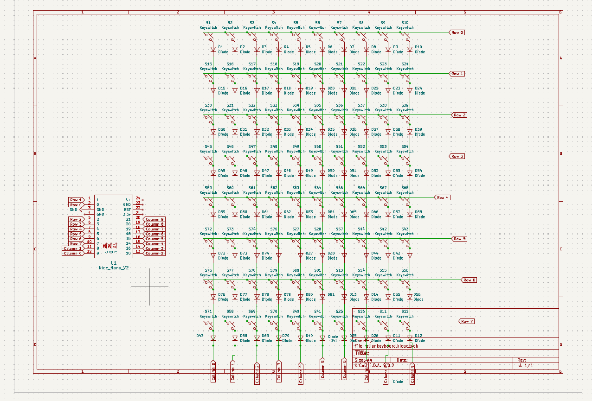
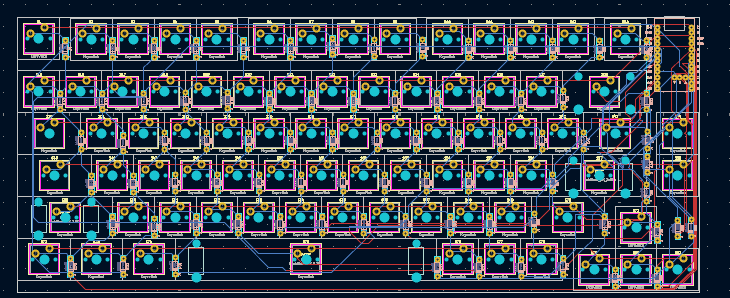
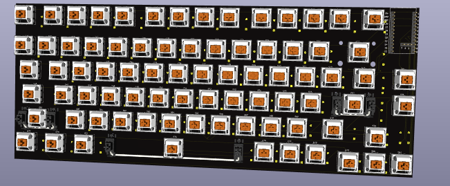
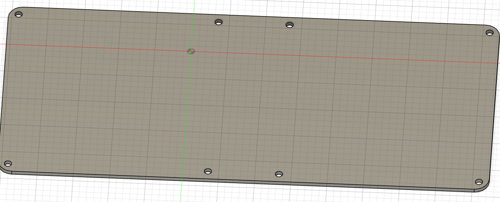
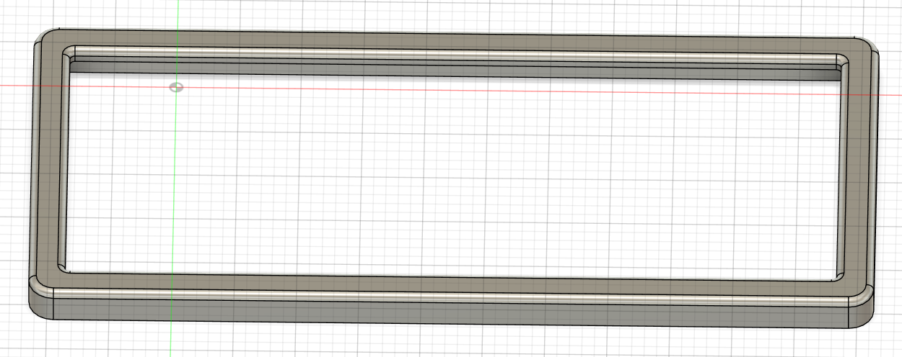
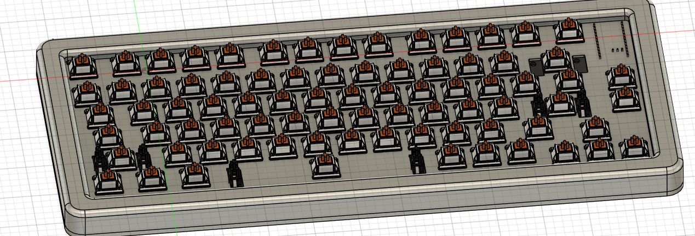

# Allan's keyboard
### About:
A 75% keyboard with a custom case. All parts under $150 USD, uses screw in stabilisers, and has akko v3 yellow switches along with M3 heatset inserts and screws. I made this project to learn more about CAD and making hardware projects. I thought it would be a reasonable next step after a macropad (was way harder actually) however I got to challenge myself and learn new things. 

[project demo](https://youtu.be/CJazeotiTts)
[good project demo](https://youtu.be/POquT2XbD1o)
### Case:

The case was made in Fusion 360 and is gasket mounted. 8 screws to ensure the keyboard is secure when printing in two parts. 

### Firmware:

The firmware was made with KMK however I intend to recreate firmware in ZMK for full bluetooth capabilities( I am currently learning as I don't want to just copilot/vibecode everything)

### Images:

Schematic

PCB

Case

### BOM:
| Item                          | Cost (USD)   | Cost (CAD)   | Link                                                                                                                                                                         |
| ----------------------------- | ------------ | ------------ | ---------------------------------------------------------------------------------------------------------------------------------------------------------------------------- |
| Akko V3 Cream Yellow Switches | \$33.00      | \$45.00      | [https://www.amazon.ca/Akko-Keyboard-Dustproof-Mechanical-Switches/dp/B0C3H8NVJV/](https://www.amazon.ca/Akko-Keyboard-Dustproof-Mechanical-Switches/dp/B0C3H8NVJV/)         |
| 3D Printer Filament (PLA 1kg) | \$21.00      | \$28.00      | [https://www.amazon.ca/ELEGOO-Filament-Dimensional-Accuracy-Compatible/dp/B0BM4F65SL/](https://www.amazon.ca/ELEGOO-Filament-Dimensional-Accuracy-Compatible/dp/B0BM4F65SL/) |
| PCB x5 (min quantity)         | \$0.00       | \$0.00       | [https://jlcpcb.com](https://jlcpcb.com)                                                                                                                                     |
| 1N4148 Diodes x100            | \$1.50       | \$2.00       | [https://www.aliexpress.com/item/1005003194692663.html](https://www.aliexpress.com/item/1005003194692663.html)                                                               |
| Durock V3 Stabilizers         | \$10.00      | \$13.00      | [https://www.aliexpress.com/item/1005002192386317.html](https://www.aliexpress.com/item/1005002192386317.html)                                                               |
| Heatset Inserts               | \$5.10       | \$7.00       | [https://www.aliexpress.com/item/1005006472962973.html](https://www.aliexpress.com/item/1005006472962973.html)                                                               |
| nice!nano v2                  | \$44.00      | \$60.00      | [https://typeractive.xyz/products/nice-nano](https://typeractive.xyz/products/nice-nano)                                                                                     |
| Keycaps                       | \$9.00       | \$12.00      | [https://www.aliexpress.com/item/1005007321700850.html](https://www.aliexpress.com/item/1005007321700850.html)                                                               |
| Screws                        | \$1.80       | \$2.50       | [https://www.aliexpress.com/item/4000056753202.html](https://www.aliexpress.com/item/4000056753202.html)                                                                     |
|                               |              |              |                                                                                                                                                                               |

| **Total (Shipping included)** | **\$123.60** | **\$170.00** |                                                                                                                                                                              |

