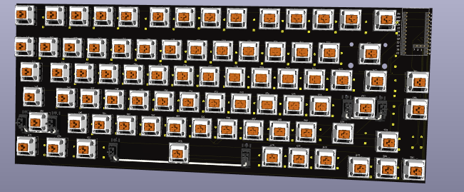
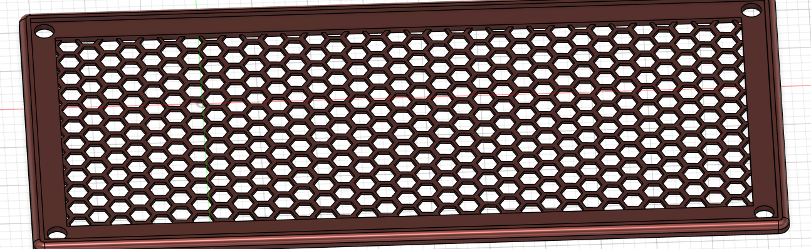
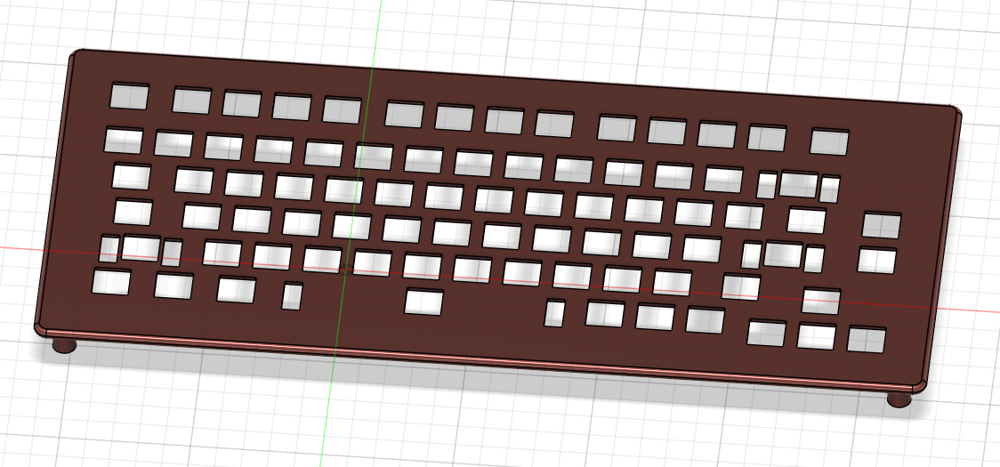
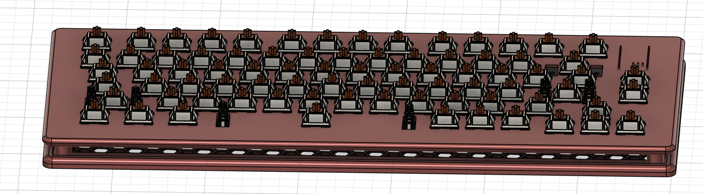

# Allan's keyboard
### About:
A 75% keyboard with a custom case. All parts under $150 USD, uses screw in stabilisers and akko v3 yellow switches along with M3 heatset inserts and screws. I made this project to learn more about CAD and making hardware projects. I thought it would be a reasonable next step after a macropad (was way harder actually) however I got to challenge myself and learn new things. 

### Case:

The case was made in Fusion 360 and features a gap in the middle (R.I.P. sound but I wear headphones anyways) and an open honeycomb pattern on the base (even worse for sound !!!!!!)

### Firmware:

The firmware was made with KMK however I intend to recreate firmware in ZMK for full bluetooth capabilities( I am currently learning as I don't want to just copilot/vibecode everything)

### Images:

Schematic

PCB

Case

### BOM:
| Item                          | Cost (USD)   | Cost (CAD)   |
| ----------------------------- | ------------ | ------------ |
| Akko V3 Cream Yellow Switches | \$33.00      | \$45.00      |
| 3D Printer Filament (PLA 1kg) | \$21.00      | \$28.00      |
| PCB x5 (min quantity)         | \$0.00       | \$0.00       |
| 1N4148 Diodes x100            | \$1.50       | \$2.00       |
| Durock V3 Stabilizers         | \$10.00      | \$13.00      |
| Heatset Inserts               | \$5.10       | \$7.00       |
| nice!nano v2                  | \$44.00      | \$60.00      |
| Keycaps                       | \$9.00       | \$12.00      |
|                               |              |              |
|                               |              |              |
| **Total (Shipping included)** | **\$123.60** | **\$170.00** |