**Total time spent:1070 mins| 18 hours**

##June 9: research and getting started

So this is my first time making a keyboard, so I decided to do some thorough research to make sure that I fully understood everything, and made it how I wanted.
I'm thinking of a 75% keyboard, specificaly something similar to Epomakers, minus the rotary encoder.
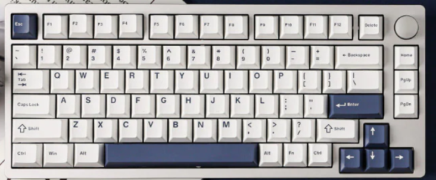

I made an initial sketch for the matrix I also decided on the Nice Nano as the mcu

*Total time spent: 30 min*

##June 9: making the schematics

Not much to say, made the matrix and connected everything.
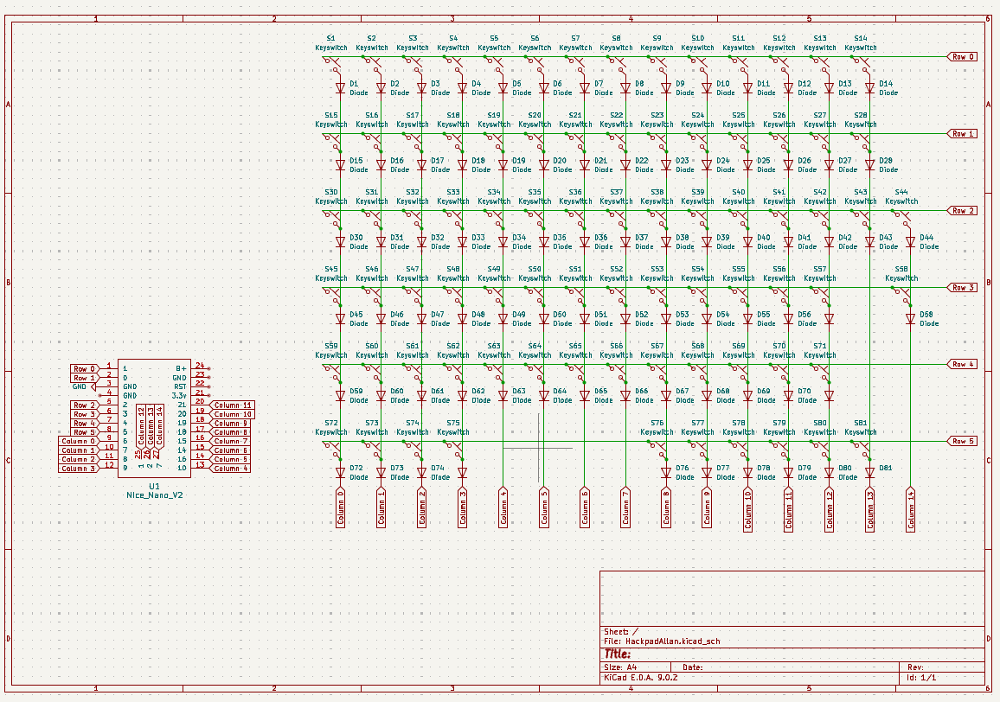

*Total time spent:90 mins*

##June 10: starting the pcb

I started off by creating my design in Keyboard Layout Editor, then spent time trying to import it into KiCad.
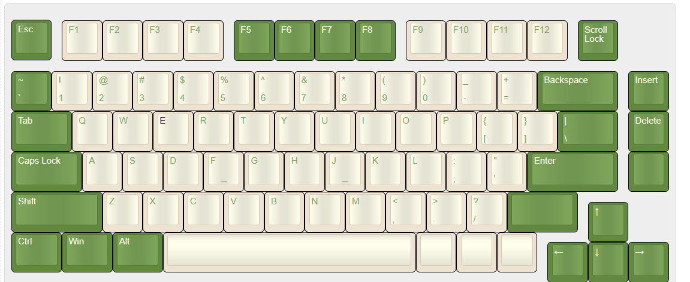

Took a really long time, I kept having problems with using the keboard placer plugin in Kicad,
had to redo footprints a bunch, set annotations and rearrange my schematic.
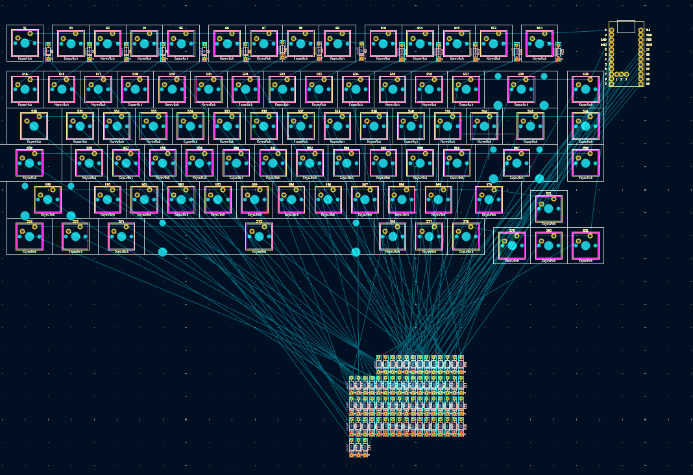
Only have to move all diodes and route traces

Update: closed the window and clicked discard change because I was sure i only made one small thing. Will be restarting but oh well.

*Total time spent: 180 mins*

##june 11: Finishing the pcb

Finished positioning everything and routing all the traces. (made sure to save this time)

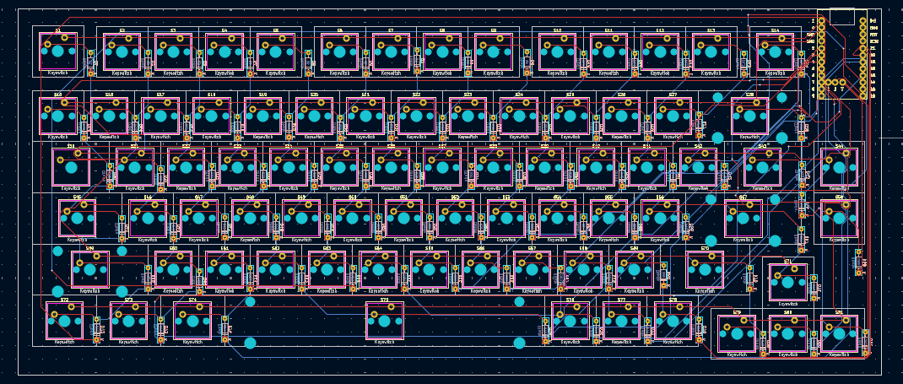

Had a problem with the switches for 3d viewing, had to manually reassign each individual switch after downloading a library online
*Total time spent: 240 mins*

##June 23: making the case

It's been a while, Just finished up school so I can focus on doing this now
For my case, i wanted to have honeycomb walls, and make it snap together to be screwless.
So my pcb's dimmensions are apparently bigger than the plate I had in fusion, so it interferes with my screws

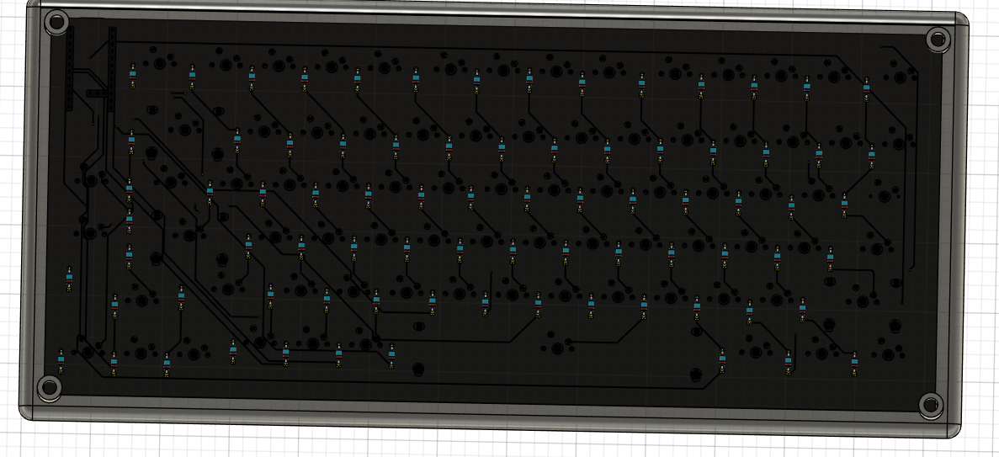

I will have to completely restart, however I hope it's easier seeing as I only need to change all the dimmensions
update: It was not a difficult fix, however looking at it it just looks really weird to me. I left a lot of space in my pcb design so I am going to get rid of it, and also I'll have to rewire all my traces.

*Total time spent: 200 mins*

##June 23: fixed pcb

I changed pcb to be on the bottom, and rerouted all the traces.

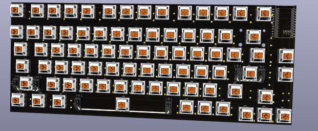
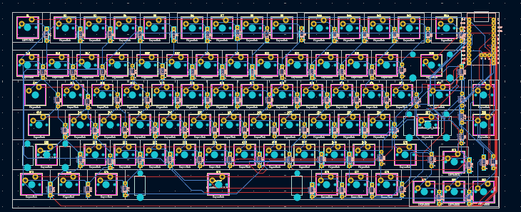
June 24 update: I <3 github, accidently overwrote and cleared all my kicad project files (idk how tbh) almost had me stressing for a minute there

*Total time spent: 60 mins*

##June 24: finishing the case:

I created a honeycomb pattern for the case and finished polishing everything up! 
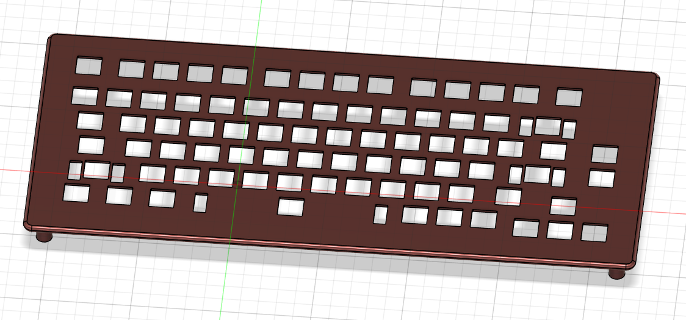
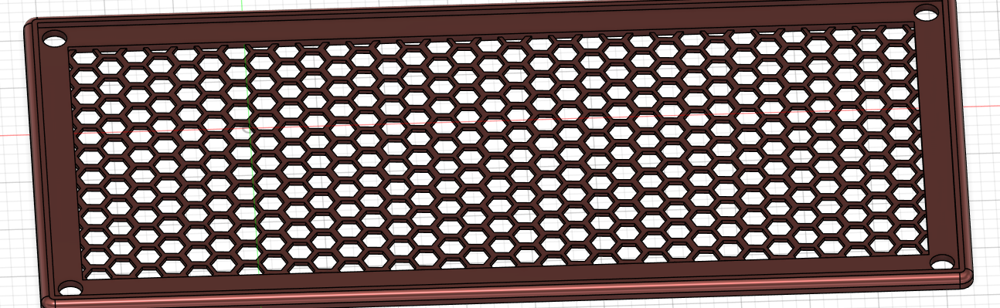
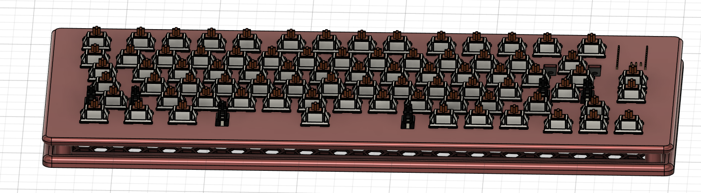
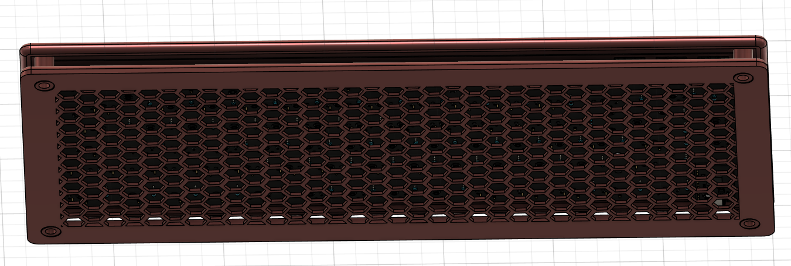

*Total time spent: 120mins* 

##June 24: big problem time

So I'm trying to write my kmk, when I look at the schematic of my nicenano and notice that the 3 middle pins aren't unique gpio pins. I made my matrix based off my actual keyboard layout rather than optimising it so I'm left with 21 gpio pins vs 18 required, which would fit on the mcu.
I can A: keep nice nano, recreate schematic, reformat and fully recreate pcb
or B: change mcu from nice!nano to something like a pico 
After debating for a while, I decided to stick with the nice nano since I wouldn't have to redo my case dimmensions and keep it more compact 

Fixed and pcb  
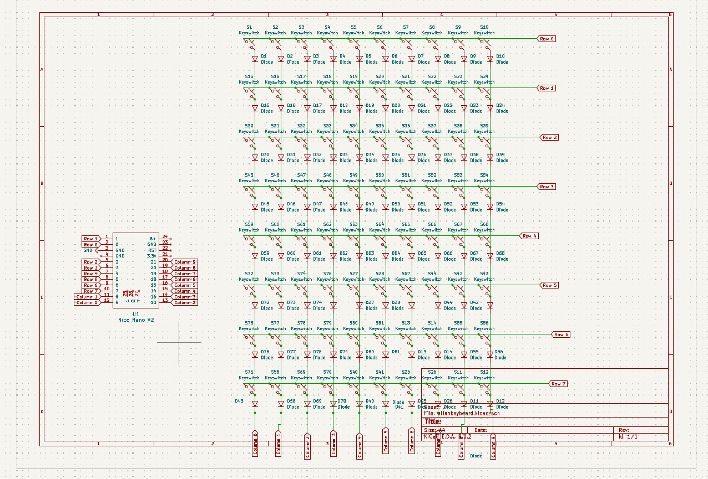

**Total time spent: 90 mins** 

##June 24: making the firmware

Not too much to say, It was a bit complicated trying to properly map the matrix, as I had to rearrange lots of things and I didn't completely restart (last entry) in theory everything should work fine however i will have to wait until I build my keyboard to see.

**Total time spent: 60mins** 
