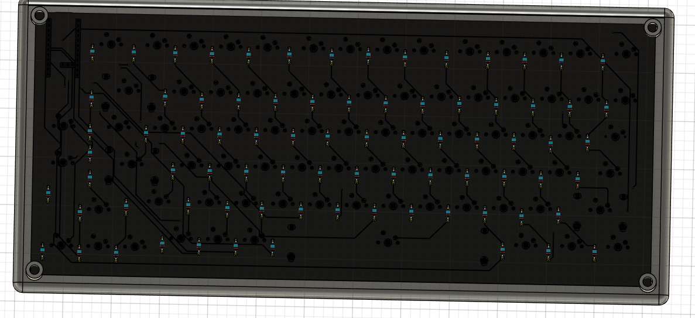

Total time spent: 

##June 9: research and getting started

So this is my first time making a keyboard, so I decided to do some thorough research to make sure that I fully understood everything, and made it how I wanted. 
I'm thinking of a 75% keyboard, specificaly something similar to Epomakers, minus the rotary encoder.

I made an initial sketch for the matrix I also decided on the Nice Nano as the mcu

*Total time spent: 30 min*

##June 9: making the schematics

Not much to say, made the matrix and connected everything. 

*Total time spent:90 mins*

##June 10: starting the pcb

I started off by creating my design in Keyboard Layout Editor, then spent time trying to import it into KiCad. 

Took a really long time, I kept having problems with using the keboard placer plugin in Kicad, 
had to redo footprints a bunch, set annotations and rearrange my schematic. 

Only have to move all diodes and route traces

Update: closed the window and clicked discard change because I was sure i only made one small thing. Will be restarting but oh well. 

*Total time spent: 180 mins*

##june 11: Finishing the pcb

Finished positioning everything and routing all the traces. (made sure to save this time)

Had a problem with the switches for 3d viewing, had to manually reassign each individual switch after downloading a library online
*Total time spent: 240 mins*

##June 23: making the case

It's been a while, Just finished up school so I can focus on doing this now
For my case, i wanted to have honeycomb walls, and make it snap together to be screwless. 
So my pcb's dimmensions are apparently bigger than the plate I had in fusion, so it interferes with my screws

I will have to completely restart, however I hope it's easier seeing as I only need to change all the dimmensions
update: It was not a difficult fix, however looking at it it just looks really weird to me. I left a lot of space in my pcb design so I am going to get rid of it, and also I'll have to rewire all my traces.

*Total time spent: 200 mins*

##fixed 50