**Total time spent:1070 mins| 18 hours**

##June 9: research and getting started

So this is my first time making a keyboard, so I decided to do some thorough research to make sure that I fully understood everything, and made it how I wanted.
I'm thinking of a 75% keyboard, specificaly something similar to Epomakers, minus the rotary encoder.
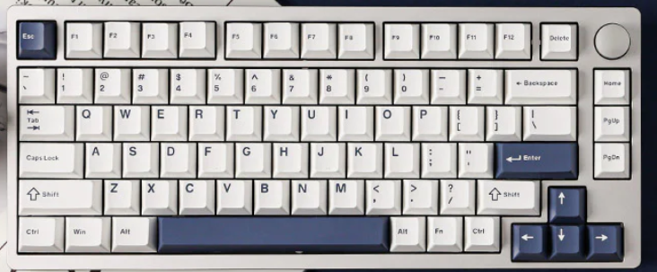

I made an initial sketch for the matrix I also decided on the Nice Nano as the mcu
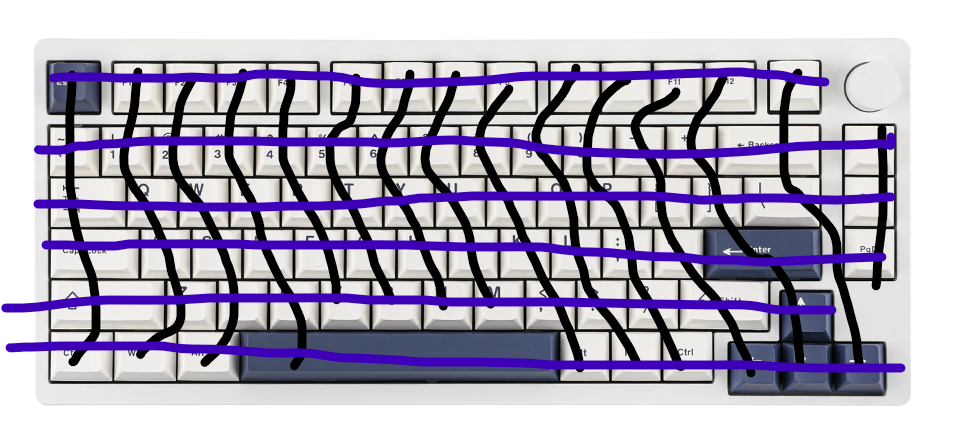
*Total time spent: 30 min*

##June 9: making the schematics

Not much to say, made the matrix and connected everything.
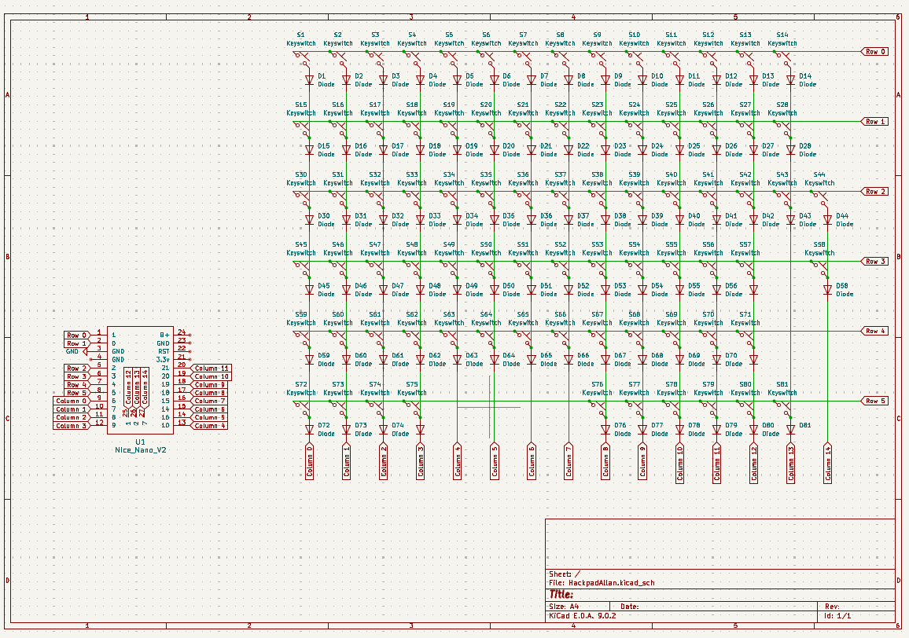

*Total time spent:90 mins*

##June 10: starting the pcb

I started off by creating my design in Keyboard Layout Editor, then spent time trying to import it into KiCad.
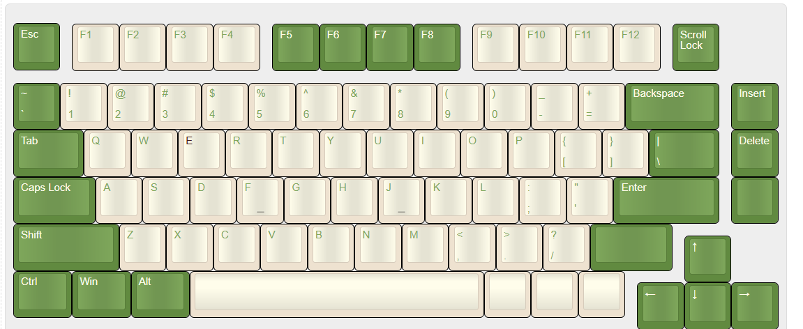

Took a really long time, I kept having problems with using the keboard placer plugin in Kicad,
had to redo footprints a bunch, set annotations and rearrange my schematic.
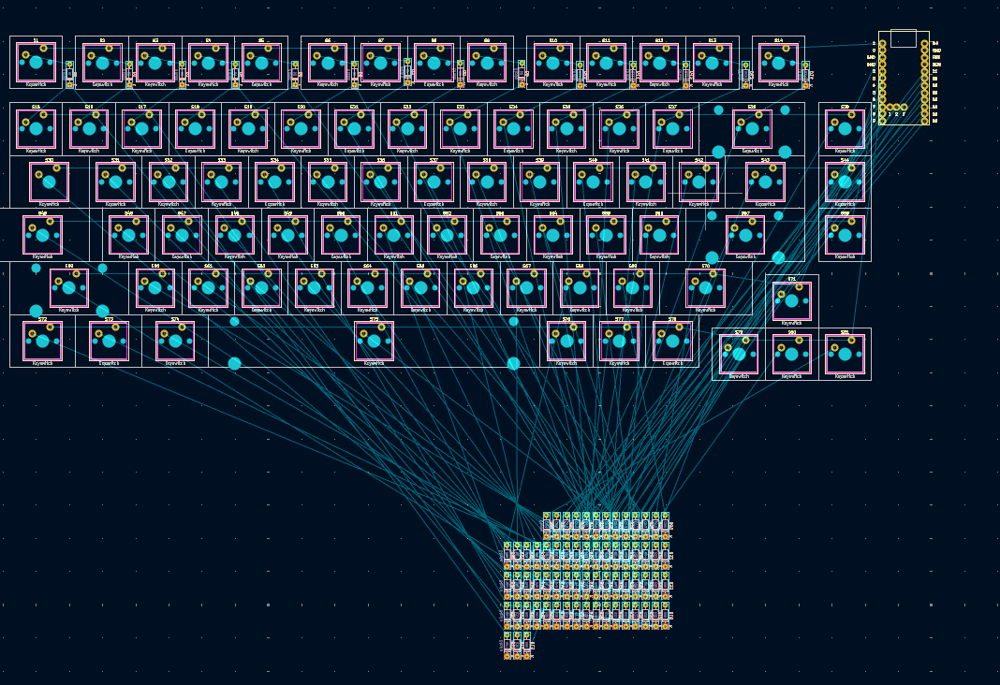
Only have to move all diodes and route traces

Update: closed the window and clicked discard change because I was sure i only made one small thing. Will be restarting but oh well.

*Total time spent: 180 mins*

##june 11: Finishing the pcb

Finished positioning everything and routing all the traces. (made sure to save this time)

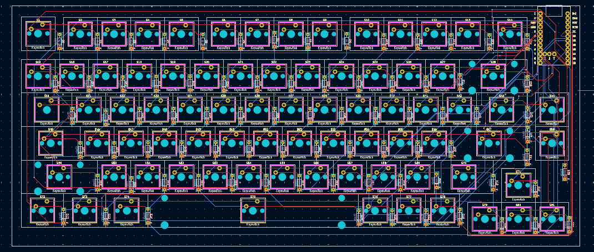

Had a problem with the switches for 3d viewing, had to manually reassign each individual switch after downloading a library online
*Total time spent: 240 mins*

##June 23: making the case

It's been a while, Just finished up school so I can focus on doing this now
For my case, i wanted to have honeycomb walls, and make it snap together to be screwless.
So my pcb's dimmensions are apparently bigger than the plate I had in fusion, so it interferes with my screws

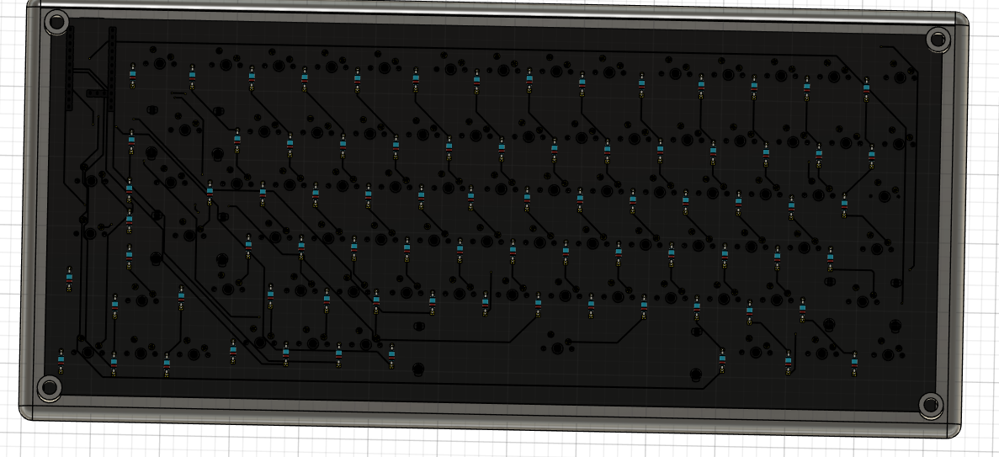

I will have to completely restart, however I hope it's easier seeing as I only need to change all the dimmensions
update: It was not a difficult fix, however looking at it it just looks really weird to me. I left a lot of space in my pcb design so I am going to get rid of it, and also I'll have to rewire all my traces.

*Total time spent: 200 mins*

##June 23: fixed pcb

I changed pcb to be on the bottom, and rerouted all the traces.

June 24 update: I <3 github, accidently overwrote and cleared all my kicad project files (idk how tbh) almost had me stressing for a minute there

*Total time spent: 60 mins*

##June 24: finishing the case:

I created a honeycomb pattern for the case and finished polishing everything up! 
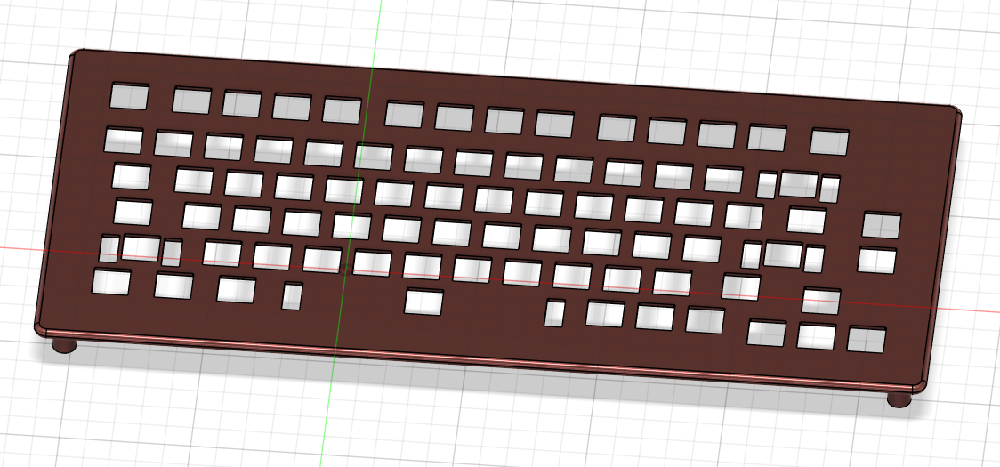
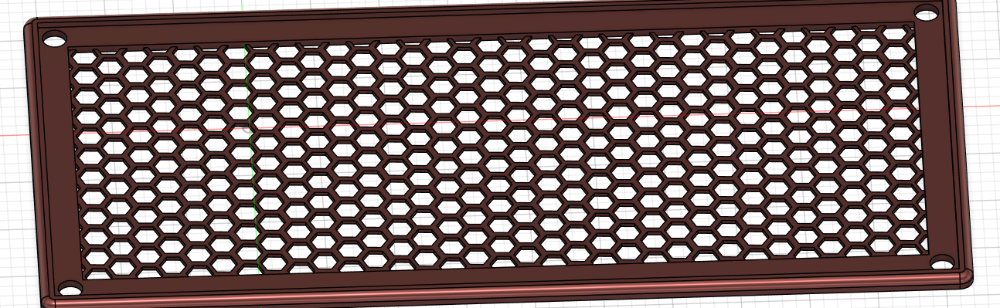
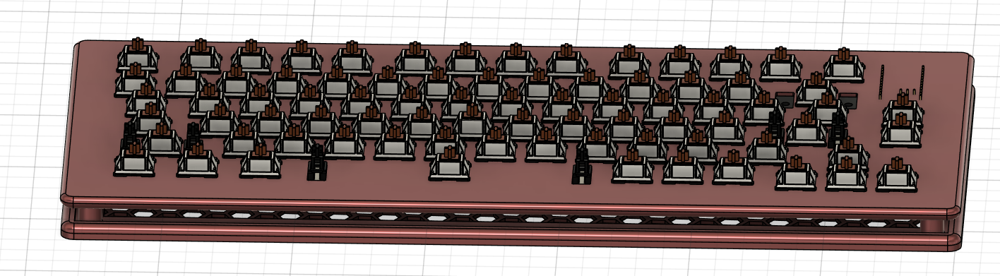
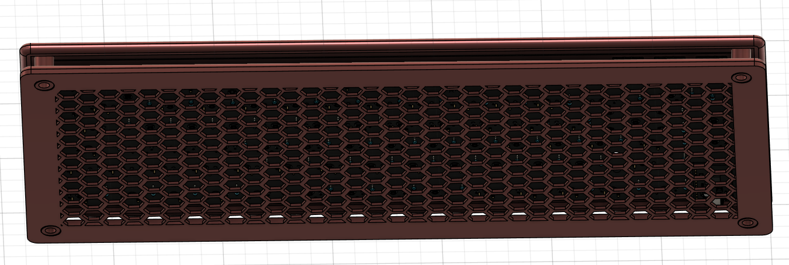

*Total time spent: 120mins* 

##June 24: big problem time

So I'm trying to write my kmk, when I look at the schematic of my nicenano and notice that the 3 middle pins aren't unique gpio pins. I made my matrix based off my actual keyboard layout rather than optimising it so I'm left with 21 gpio pins vs 18 required, which would fit on the mcu.
I can A: keep nice nano, recreate schematic, reformat and fully recreate pcb
or B: change mcu from nice!nano to something like a pico 
After debating for a while, I decided to stick with the nice nano since I wouldn't have to redo my case dimmensions and keep it more compact 

Fixed and pcb  

**Total time spent: 90 mins** 

##June 24: making the firmware

Not too much to say, It was a bit complicated trying to properly map the matrix, as I had to rearrange lots of things and I didn't completely restart (last entry) in theory everything should work fine however i will have to wait until I build my keyboard to see.

**Total time spent: 60mins** 

##July 28: building the project

I decided the old case wasn't good enoug (after my friend pointed out) because It didn't necessarily have a real case and the plate was acting as one. 
Future allan after building the keyboard: this was the greatest decision ever made for so many reasons, details later in journal 

I soldered the diodes and mcu, I'm still finishing the prints so I loaded the firmware onto the mcu.
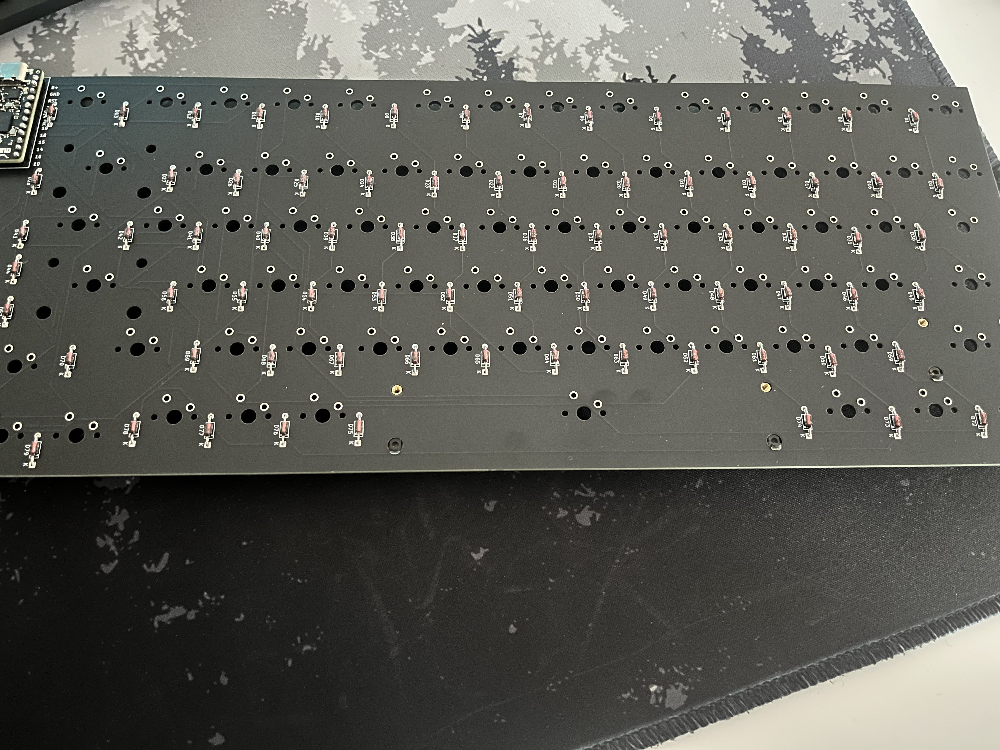
side note: I just finished soldering the diodes and the mcu. I realised there were two extra pins that did not have headers and I was very scared I messed up and would have to resolder. Checked the pinout and there is just two random pins that aren't supposed to be soldered for some reason

**Total time spent: 60mins**

##July 30: finishing the project 

I started off by assembling the case. I didn't take a picture of this specifically but each part was printed in two bc it didn't fit on the printer. It was really flimsy so I pretty much melted the plastic with a soldering iron fusing the parts together. 
time: 30 mins

I was busy snapping all my switches into my plate when I noticed the plate began to start bending due to the outward pressure on the walls of each cutout. I tried to fix this by aliging the plate over the plate over the pcb and inserting the switch like that, however this didn't work and I left it curved. 

Fortunately, after soldering the switches into the pcb, It was more stable and no longer as curved

time : 120 mins

for the final part, I just had to add heatset inserts, screws, and put everything together. 
I'd say this part went ok, because of the plate bending from earlier I had to push down just to be able to screw in the case bottom. It actually created a gap between top + bottom case so I kind of just stuck my soldering Iron into the case and it fixed it. 

I added the keycaps and I was finally done my keyboard! 

Final result 

This goes with the part where I soldered the switches but I just realised and figured it goes better with the picture I have. Becase I bottom mounted the mcu, the pins poked out slightly too much that it interfered with the plate. I tried cutting the pins shorter and ended up breaking my wire cutters. I then used pliers to bend them in half but still noting worked. I had to cut out that part of my keyboard and leave it exposed. I do plan to create a new plate top, this time covering over the new empty hole + additional features. 

